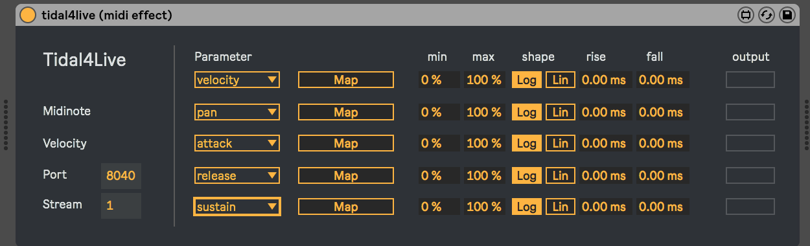

# Tidal4Live


Tidal4Live consists two Max4Live devices that makes interaction with the
[TidalCycles live coding environment](http://tidalcycles.org/) easy. One of the devices is a midi effect (that you can control software instruments with) and the other is an audio effect that you can insert in any audio chain and then map wherever you want).

Compared to a "normal" virtual midi connection between Tidal and Ableton, there
are a few pros and cons to be considered before going this route instead of
[tidal-midi](https://github.com/tidalcycles/tidal-midi).

**Video: See tidal4live in action**

[](http://www.youtube.com/watch?v=R_NFiOVosno "tidal4live test")

**Pros**
* Easy to set up
* Mapping Tidal parameters to any midi modulatable parameter in Ableton is easy

**Cons**
* Tidal4Live doesn't write midi notes in Ableton (yet)
* Timing isn't super precise (but neither is tidal-midi's)

### Known issues
tidal4live is in the experimental stage and as such is full of weird issues.
Here are some of them:

* Timing can be wonky (the m4l devices are actually rigged for time stamps but
  not using them yet)
* Midi notes can't be recorded by Ableton
* Sometimes when setting up, MaxMSP doesn't receive any data and changing the
  port is needed to make it work again.

### Installation

1. Download and install the [tidal-maxmsp package](https://github.com/madskjeldgaard/tidal-maxmsp)
2. Drag the two .amxd devices into Ableton.

### Usage

Open up Tidal in your favourite code editor. You don't need SuperDirt to use this example. Run the code below to start sending osc data.

```haskell
-- 1. Import the Max Msp module which defines an osc stream and what to send + how
-- It basically sends data off as a list of pairs (parameter, value) to the url /fromTidal/<streamNumber> 
import Sound.Tidal.MaxMspOsc

-- 2. Open up a connection
--
-- You can make as many of these connections as you want, just remember to
-- choose an unused stream (or port) when you make a new one
max1 <- maxmspStream "127.0.0.1" 8010 1 -- Destination ip (default is your own computer), port and streamNumber

max2 <- maxmspStream "127.0.0.1" 8020 1 

max3 <- maxmspStream "127.0.0.1" 8030 1

-- 3. Start live coding

max1 -- port 8010
$ sometimesBy 0.1 (degrade)
$ slow "<4 1 8>" 
$ sometimesBy 0.5 (0.25 <~ )
$ n "0 8 2 0 ~ 3 2" 
# velocity "0.25 0.5 0.0 1.0"
# fold (slow 12 $ saw)

max1 silence

max2 -- port 8020
$ fast "<1 1 1 2 2 2 2 2 2 2 3 3>"
$ n "0 8 2"
# fold (scalex 0.25 1.0 $ slow 16 $ saw)
# velocity (scale 0.5 1.0 $ slow 32 $ sine)
|+| n 12

max2 silence

max3 -- port 8030
$ slow 4
$ n "0"
|=| fold "0.5 0.1 0.75"
|=| velocity (scale 0.75 1.0 $ saw)

max3 silence
```

In Ableton Live, put one of the tidal4live devices on a track. 

In the parameter drop down boxes you can choose what tidal parameter to map. There's a bunch of standard tidal params but also some custom ones. These all work in Tidal. Click one of the drop downs to see all of them.

If you're using the example above, you should now see some activity in the velocity parameter under the output. It should blink up and down, indicating that it's receiving data on the velocity parameter (and the amount from 0.0 to 1.0).

Now, press the map button to map it to any midi mappable parameter in Ableton Live. Finish the mapping by clicking on the parameter you want to map it to.

